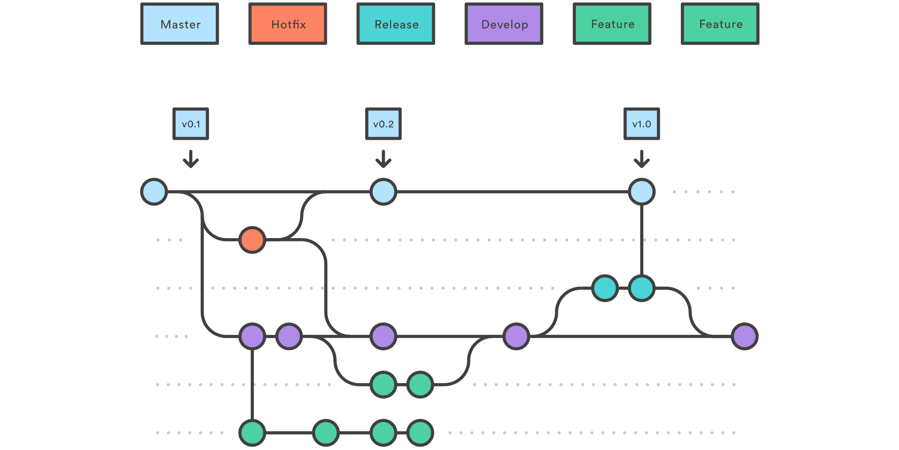

# Welcome

Repository of the Demonstrator for LeanDA

### LeanDA

LeanDA is a plug-and-play toolkit for process optimization, by combining wireless sensors with AI enabled process recognition. 

### Technology stack and Requirements

- Backend and Data Analytics: Python
- Frontend: JS

### Content

- [Documentation](Documentation/)
- [Python code](src/)

## Installation and execution 

### Frontend:

/public/index.html

### Start Backend/Model (order of commands is important):

1. Activate virtual (python) environment

3. Start raw data dummy server (in src/):

        python raw_data_dummy.py

    (command line is just going to blink after execution)

4. Open new command line and repeat steps 1 and 2, then start the server for evalutation/model:

        python eval_server.py

5. Use websocket client to connect

## Contribution

### Gitflow
We are using the **gitflow** workflow for branching within this project.
The basic workflow is shown in the image below:

[**Klick here**](https://www.atlassian.com/git/tutorials/comparing-workflows/gitflow-workflow) 
If you are interested in a detailed description of **gitflow**.

#### Naming conventions for branches

Base your work on the `development` branch

- `release_*` for next planned release
- `feature_*` for development of new features
- `fix_*` for hot fixes
- `refactor_*` when refactoring code without behavior changes

#### Commit Messages

Please use the following template for your commit message:

    ---- start ----
    [Label: ADD, REFACTOR, DELETE]
    -- empty line --
    [File: Function]
    -- empty line --
    [short line describing main purpose]
    -- empty line --
    [description, why this change is made]
    -- empty line --
    [close/fix #xxxx - link to gitlab issue id]
    ---- end ----

